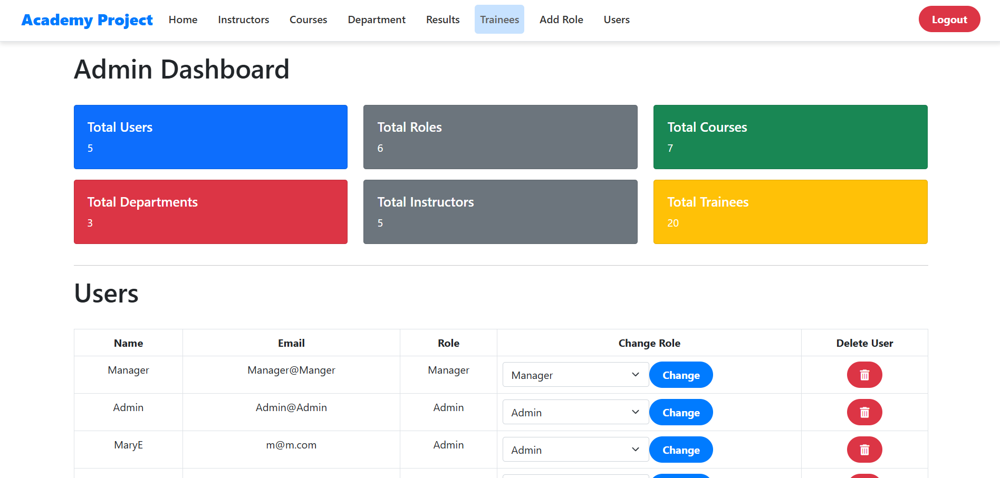
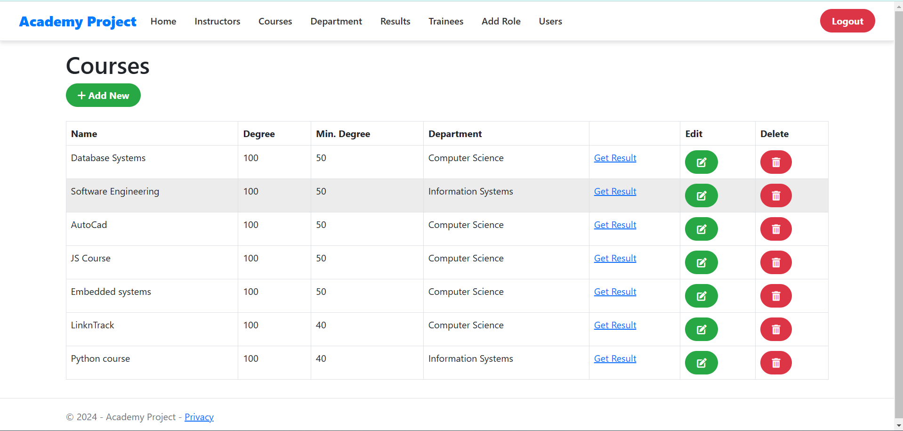
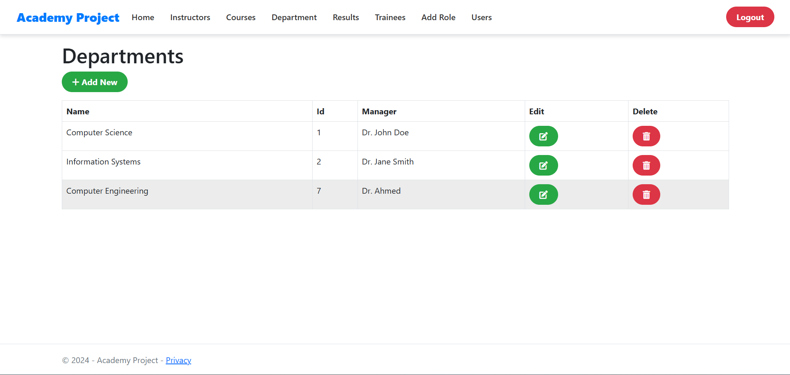
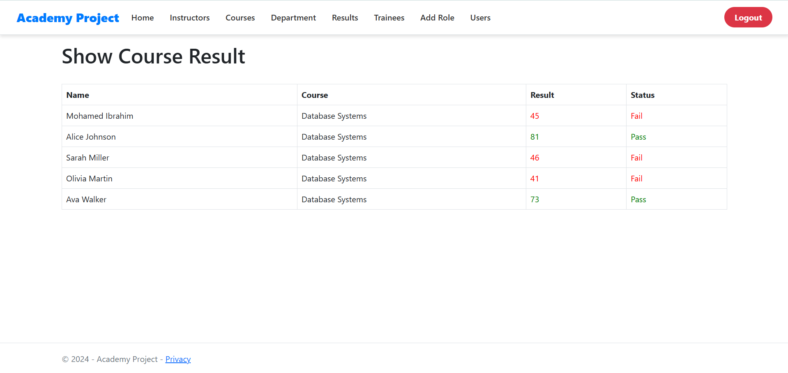

## 📑 **Table of Contents**

1. [🎓 Academy Project](#-academy-project)
2. [✨ Features](#-features)
   - [🔑 General Features](#-general-features)
   - [📊 Admin Features](#-admin-features)
   - [📑 Results Management](#-results-management)
3. [🛠️ Technology Stack](#%EF%B8%8F-technology-stack)
4. [🚀 Getting Started](#-getting-started)
   - [Prerequisites](#prerequisites)
   - [Setup](#setup)
5. [🖼️ Screenshots](#%EF%B8%8F-screenshots)
6. [🌐 Live Demo](#-live-demo)
7. [🤝 Contributing](#-contributing)
8. [📜 License](#-license)
9. [📬 Contact](#-contact)
## 🎓 **Academy Project**  

Welcome to the **Academy Project**! This is a CRUD-based web application built with **ASP.NET MVC**, designed to streamline academic workflows while adhering to **SOLID principles** for clean and maintainable architecture.  

---

## ✨ **Features**  

### 🔑 **General Features**  
- 🔄 **Full CRUD Operations**: Manage courses, trainees, instructors, departments, and results.  
- 🔐 **Role-Based Authentication with ASP.NET Identity**:  
  - 🛠️ **Admin**: Full access, including user and role management.  
  - 👔 **Manager**: Limited CRUD access for managing resources.  
  - 🆕 **No Role**: New users with restricted permissions but can test adding instructors.  
- ✅ **Validations**: Server-side and client-side validations for robust data integrity.  

### 📊 **Admin Features**  
- 📈 **Dashboard**: Displays total counts for users, roles, courses, departments, instructors, and trainees.  
- 🔧 **User Management**: View details, change roles, delete users, and create new roles.  

### 📑 **Results Management**  
- 📋 View results for individual trainees in specific courses.  
- 🗂️ Access all course results or a trainee's results across all courses.  

---

## 🛠️ **Technology Stack** 

- **Framework**: ASP.NET MVC  
- **Database**: SQL Server with Entity Framework Code First  
- **Authentication**: ASP.NET Identity  
- **Design Patterns**: Repository Pattern and Dependency Injection  

---

## 🚀 **Getting Started**  

### **Prerequisites**  
- 🖥️ Visual Studio 2019 or later  
- 🗄️ SQL Server  
- ⚙️ .NET 6.0 SDK or later  

### **Setup**  
1. Clone the repository:  
   ```bash  
   git clone [repository_url]  
   cd [repository_name]  
2. 🔑 **Set up the database connection string**:  
   - Open `appsettings.json` or `web.config`.  
   - Replace the placeholder connection string with your local database connection details:  
     ```json
     "ConnectionStrings": {
       "DefaultConnection": "Server=YOUR_SERVER;Database=YOUR_DATABASE;Trusted_Connection=True;MultipleActiveResultSets=true"
     }
     ```  

3. 📦 **Run the migrations to create the database**:  
   - Open the **Package Manager Console** in Visual Studio and run:  
     ```bash
     update-database
     ```  

4. ▶️ **Build and run the project**:  
   - Press `F5` or run the project from Visual Studio to launch the application.  
   - The application will open in your default web browser.  

---  

## 🖼️ **Screenshots**  

- 📊 **Admin Dashboard**
  

   
- 🛠️ **Instructors Page**
  .png)

  
- 🛠️ **Courses Page**
  

  
- 🛠️ **Departments Page**
  

  
- 🛠️ **Result Page**
  

---

## 🌐 **Live Demo**

🎉 Try the live version hosted on **Monster ASP.NET Server**: [[Academy Project](http://ahmedibrahim.runasp.net/)]  

📹 Watch the project demo here:  
➡️ [](https://youtu.be/5su9Ui4BmtY)

 
---

## 🤝 **Contributing**  

Contributions are welcome! 🎉  
1. Fork the repository.  
2. Create a new branch for your feature or bug fix.  
3. Submit a pull request and describe your changes.  

---

## 📜 **License**  

This project is licensed under the **MIT License**.  

---

## 📬 **Contact**  

Have questions or suggestions? Feel free to reach out:  
- 📧 **Email**: [ahmedibrahim000074@gmail.com]  
- 🔗 **LinkedIn**: (https://www.linkedin.com/in/ahmed-ibrahim-603a38212/)  

---

Enjoy exploring the **Academy Project**! 🚀  
